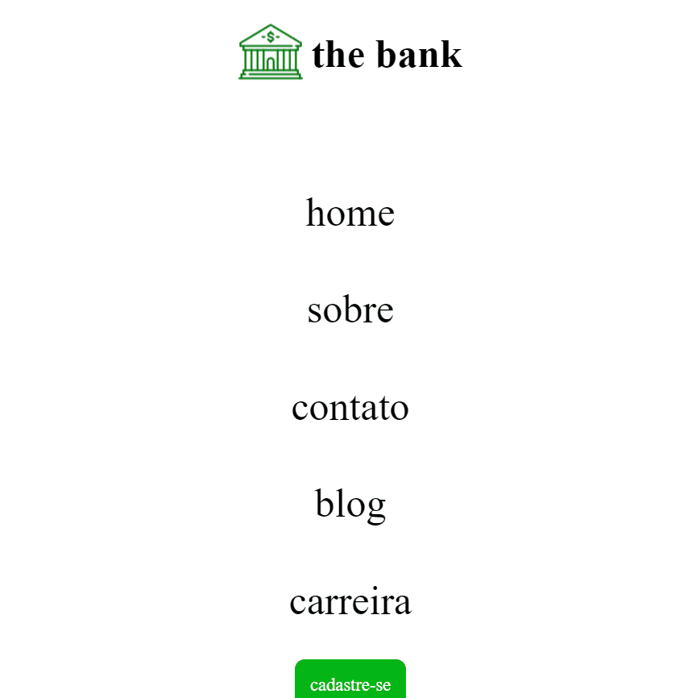
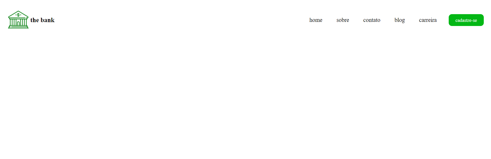

# Pagina Responsiva 📱

Neste projeto foi criado primeiramente a parte mobile logo após foi feita a parte responsiva para tela maiores.
Projeto criado através do Curso Dev Quest 

 

## Versao web 💻

## Ferramentas 🔨
- HTML
- CSS

## Aprendizado 🧠
Pude estar compreendendo novamente o uso do @media query digamos que de uma certa forma diferente pois o uso dela neste projeto foi feito para quando obtece uma versao maior de tela o conteudo inserido adequa de uma boa forma alterando a sua posiçao.